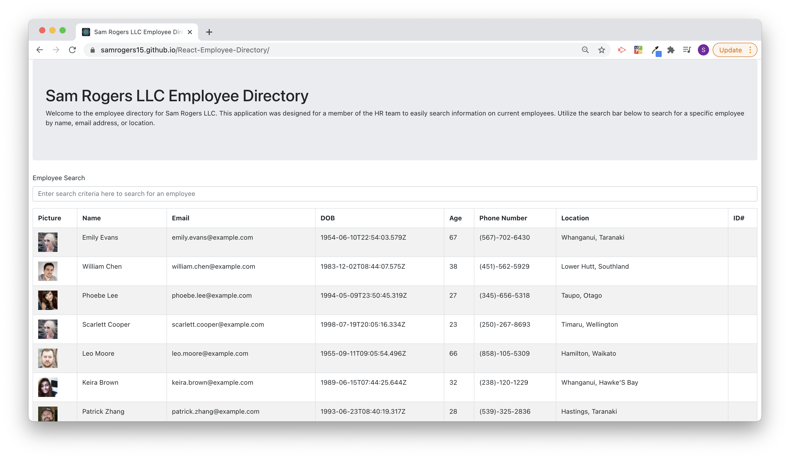

# React-Employee-Directory
> This is a repository for an application that allows a user to manage information on a list of employees for their company. The user can scroll through the list of employees or search for a specific employee by the criteria of their choice.
 
## Table of contents
* [General Info](#general-info)
* [User Story](#user-story)
* [Technologies](#technologies)
* [Live Link](#Live-Link)
* [Screen Shot](#Screen-Shot)
* [Code Snippets](#code-snippets)
* [Sources](#sources)
* [Contact](#contact)

## General Info
The application uses a random user generator API from the site randomuser.me and renders the random user information onto the page using an API call. From there, the useState and useEffect hooks are utilized to allow a user to search for specific criteria on the employee they want to view.

## User Story
As a user, I want to be able to view my entire employee directory at once so that I have quick access to their information.

## Technologies
* React
* Javascript
* HTML/CSS
* Bootstrap
* Node

## Live Link
[React-Employee-Tracker](https://samrogers15.github.io/React-Employee-Directory/)

## Screen Shot


## Code Snippets

The below example code shows the setup for the row of the table where the data is displayed:
```js
const EmployeeRow = ({ picture, name, email, dob, phone, location, id }) => (
  <tr>
    <td>
      
    </td>
    <td>
      {name.first} {name.last}
    </td>
    <td>{email}</td>
    <td>{dob.date}</td>
    <td>{dob.age}</td>
    <td>{phone}</td>
    <td>
      {location.city}, {location.state}
    </td>
    <td>{id.value}</td>
  </tr>
);
```

The below example code shows the setup of the search bar functionality:
```js
const SearchBar = ({ search, setSearchState }) => {
  return (
    <>
      <Form>
        <Form.Group>
          <Form.Label>Employee Search</Form.Label>
          <Form.Control
            type="text"
            placeholder="Enter search criteria here to search for an employee"
            value={search}
            onChange={({ target }) => setSearchState(target.value)}
          />
        </Form.Group>
      </Form>
    </>
  );
};

```

## Sources
Application enabled using the following sources:

* [RandomUser.me](https://randomuser.me/)
* [React Documentation](https://reactjs.org/docs/getting-started.html)
* [React Bootstrap](https://react-bootstrap.github.io/)

## Contact
Created by Sam Rogers - feel free to contact me to collaborate on this project or any other project!

[LinkedIn](https://www.linkedin.com/in/samuelerogers/)

[Portfolio](https://samrogers15.github.io/Current_Portfolio/index.html)